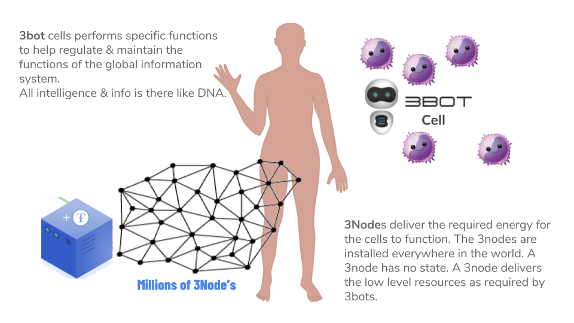
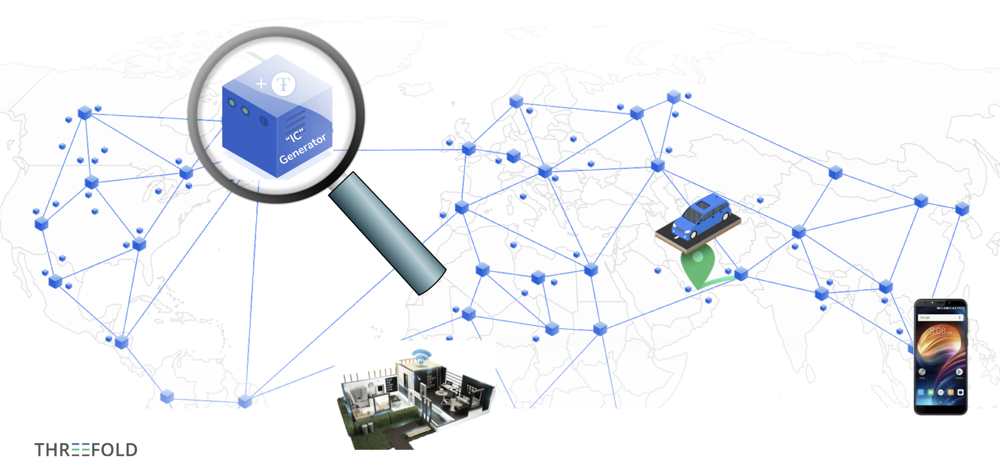
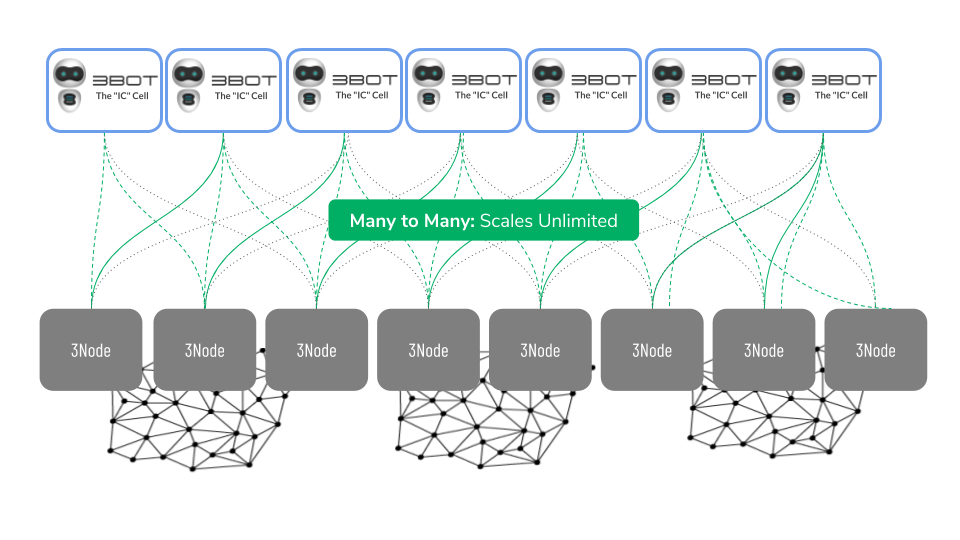

# FreeFlow Internet

**"We can't solve problems by using the same kind of thinking we used when we created them"  **

**Einstein**

## We need a complementary Internet.

We need a digital backbone to create our FreeFlow Nation. Today we have the internet connecting us all but unfortunately, it's too expensive, power hungry, centralized and not scalable enough.

More than 80% of today’s internet capacity is centralized and controlled by just a handful of companies

## ThreeFold has made such a complementary internet possible

### Inspired By Nature

Our [Decentralized Information System](https://docs.google.com/document/d/1uZT03h4QLBh2RYEnUjZQvi2Xoy8fjbUn1eZN_PM8g6g) (DIS) Works like Cells in our Body

### The system is active

**ThreeFold farmers have already deployed 10x more capacity compared 
to the sum of all other decentralized projects together (blockchain).**

**There are 3 ways today which allow you to buy Internet Capacity:**

ThreeFold can deliver Internet Capacity at a price much lower than alternative centralized solutions and is much faster and more scalable compared to some newer blockchain alternatives.

The cost advantages are substantial.

### Unlimited Scalability

In this system the 3bots which are the intelligent cells scale independently from the 3nodes, this creates an unlimited, scalable system. The 3bots use the resources of the 3nodes to bring any required service to life 

More info about this system in our [Decentralized Information System document](https://docs.google.com/document/d/1uZT03h4QLBh2RYEnUjZQvi2Xoy8fjbUn1eZN_PM8g6g).