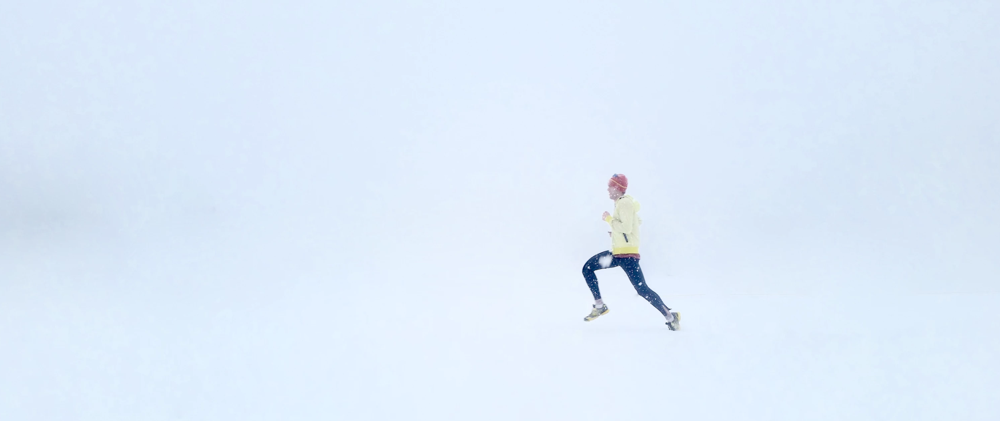
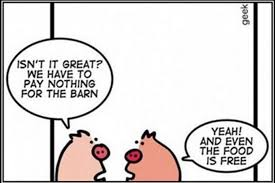

## Our 3x3 FreeFlow Values

### 1. Everyone can participate and has equal chances

* Independent of location, race or religion. Censorship should not block access to information.

* Cost of the information system needs to be low enough so that everyone can afford to participate. 

* Everyone can deliver services or products to everyone else with minimal intermediate steps. Intermediaries are often necessary but should charge fair costs in relation to their added value. 
It's not acceptable that a poor farmer receives only 5% of the price we pay for the product in the shop. This is neither sustainable for them nor for the planet.

### 2. Respect is the basis of our communication and actions.

* We declare that respect and not fear nor ego will be the basis of our communications and our actions in this digital nation. 

* We don’t have to agree, but respect and tolerance for other opinions is a must. 

### 3. Everyone has control over their own information & community circles

* We have sole ownership of our created information/content e.g. photos, text, videos, … 

* No-one has access to our information unless we have given explicit access rights. 

* We define the circles (groups of people) we want to communicate with and we have absolute freedom to decide what we want to share, and with whom we share it. 

* We can at any point in time retrieve/destroy our information or revoke access rights.

### 4. Information is neutral, verifiable and accessible for everyone

* Data cannot be manipulated and we can ask for verification of the information at any point in time, it's up to the person who shares to withhold that  proof but at least we then know that the source wants to stay anonymous and cannot be validated. 

* It should be technically impossible for a hacker or other organization to change information and represent it in another way than originally intended.

* We have the ability to search & consume information in  freedom and neutrality.
We don’t like that an AI (Artificial Intelligence) machine decide what information gets priority or is blocked. Today we navigate in a restricted information world, much smaller than we believe. Keeping us uninformed and manipulating the information which is being presented to us can influence our consumption and voting actions.

* Censorship is not acceptable and goes against our beliefs; info should be accessible for everyone.

### 5. We should never be a product.

<table>
  <tr>
    <td>  </td>
    <td>We have become a product of a big data machine.

Every action we take on our social media, internet searches, … leads to more information used and paid for by ourselves.

We believe we get these services for free. 

Because of this model we pay maybe 20-50% too much for our required products & services.
</td>
  </tr>
</table>

### 6. We need to respect the World’s resources and we need to pay for what we consume

* If we don’t want to be the product then we need to accept paying for what we consume.

* When it's free it means we are the product. Free does not exist, often it means we pay in other ways at a price in excess of  the cost of the resources we actually use.

* We need to be respectful of finite world resources.

### 7. Everyone has access to reliable complementary currencies 

* Complementary currencies are not meant to replace existing currencies but rather complement. They can have unique properties, they can be designed more as a store of value, or serve as a medium of exchange.

* We need to be able to keep our fiat or digital currencies safe at all times.

* We need to be able to exchange value without having to pay huge transaction or exchange fees.

* Others should not be able to influence or obtain a non-transparent benefits from our transactions.

### 8. Products need to be sustainable and fairly described

* We declare that we want to produce high quality and sustainable products or services.

* We need the description of products and services to be done fairly. A transparent reputation system can help.

### 9. We accept that we are not powerless and need to act ourselves.

* Many of us believe we have no choice and need to live in the current structures without a chance to have an impact. We believe everyone is a master of their own destiny.

* The current systems are huge and very efficient but that also makes them very vulnerable

* If only 10 percent of us would change the buying decisions we make, these large companies would not be able to continue the way  they currently work and change would come. These companies are more vulnerable than we believe.

* We have to be responsible and look at the choices we can make ourselves: what do we eat, consume, travel too, …

* This doesn’t mean we have no right to a financially comfortable life, but it means we have to act and help heal the world.
