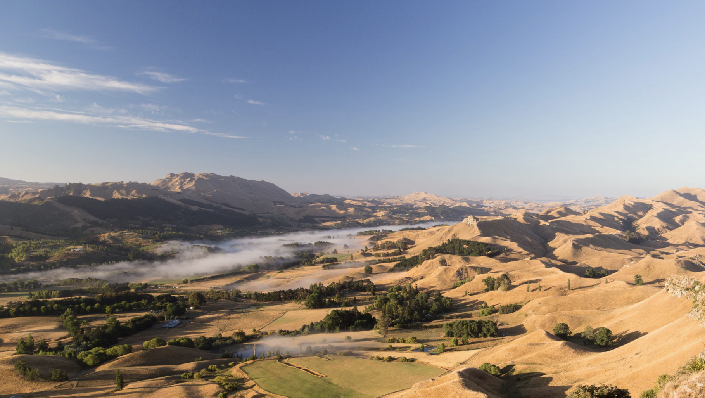

# FreeFlow Nation Manifesto 			[http://](http://freeflowmanifesto.threefold.me)[freeflowmanifesto.threefold.me](http://freeflowmanifesto.threefold.me)

We (the citizens of FreeFlow Nation) believe the world needs a new nation, a global complementary digital nation. A Nation to complement not replace our existing nations, a Nation which has no physical boundaries and which welcomes everyone as a digital citizen.

**A digital Nation where everyone chooses to honor the following values :
**

1. Everyone can participate and has equal chances

2. Respect is the basis of our communication and actions

3. Everyone has control over their own information & community circles

4. Information is neutral, verifiable and accessible for everyone

5. We should never be a product

6. We need to respect the world’s resources and we need to pay for what we consume

7. Everyone has access to reliable (complementary) currencies

8. Products need to be sustainable and fairly described

9. We accept that we are not powerless and have a responsibility to act 

We have been working for more than 15 years on a technology that can facilitate this platform and vision.

It's not just a set of ideas, we have already developed most of the required technology and are executing a practical achievable plan.

# Reality Check

Our team is not big enough at this point to execute on all as defined above. We need to be very focused to execute on what is required first.

We already got amazingly far but some items need more ‘love’:

* Web Presence is not in line with vision & capabilities & mission, people get confused.

    * A lot of information missing on our wiki’s and github (our code repositories)

* Marketing Message not good enough

    * Need to go over all text & information & make consistent

* ...

